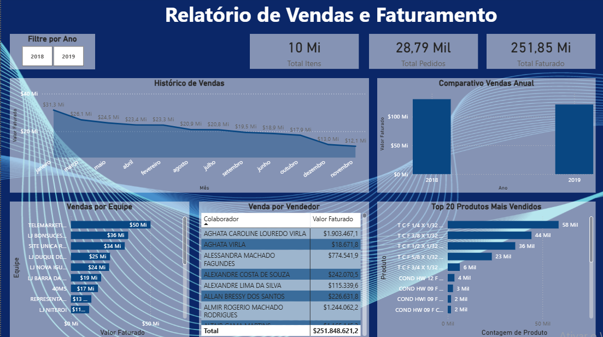

# Dashboard de Vendas e Faturamento – Power BI

Este projeto foi desenvolvido como parte de um **teste técnico em Power BI** durante um processo seletivo. O objetivo foi construir um dashboard completo a partir de uma base de dados fornecida pela empresa, com foco em análise de vendas e faturamento.

## 🎯 Objetivos do Projeto

- Criar tabelas de apoio: `dCalendário` e `dProduto`
- Desenvolver visualizações para:
  - Vendas por Equipe
  - Vendas por Vendedor
  - Histórico Mensal de Vendas
  - Comparativo de Vendas com o Ano Anterior
  - Top 20 Produtos Mais Vendidos
- Incluir uma visualização adicional livre com base nos dados

## 🛠️ Ferramentas Utilizadas

- **Power BI Desktop**
- **Power Query** para transformação de dados (ETL)
- **DAX** para criação de medidas e KPIs
- Gráficos de barras, linhas, segmentações e tabelas dinâmicas

## 📊 Captura de Tela do Dashboard

(O dashboard apresenta indicadores de desempenho, gráficos interativos e análise comparativa entre anos.)

---

## 🔒 Sobre os Dados

> A base de dados utilizada neste projeto foi disponibilizada pela empresa contratante exclusivamente para fins de avaliação e **não será compartilhada publicamente**.

O foco deste repositório é destacar o processo analítico, modelagem de dados, criação de medidas com DAX e design das visualizações.

---

## 🔎 Principais Insights

- A equipe **Telemarketing** liderou o faturamento entre todas as equipes.
- A vendedora **Aghata Caroline Louredo Virla** foi a maior responsável pelo valor total faturado.
- A venda teve seu pico no início do ano, com tendência de queda ao longo dos meses.
- Produtos do tipo "T C F" dominaram a lista dos mais vendidos.
- O comparativo anual demonstrou crescimento em relação ao ano anterior.

---

## ✅ Status do Projeto

✔️ Projeto finalizado e entregue com sucesso durante o processo seletivo.

---

## 💼 Linkedin / Portfólio

Se você quiser visualizar o projeto completo e outros materiais do meu portfólio:

🔗 [linkedin.com/in/seu-nome](https://www.linkedin.com)  
🔗 [github.com/seu-usuario](https://github.com)

---

## 🏷️ Tags

`#PowerBI` `#DataAnalytics` `#VisualizaçãoDeDados` `#Dashboard` `#Portfólio` `#ProcessoSeletivo`

